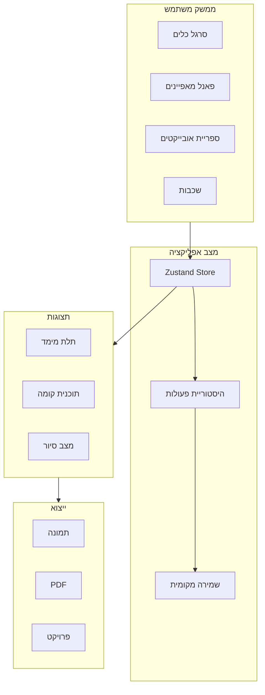

# שדרוג מקיף לעורך התלת מימד

## סקירה

בניית עורך תלת מימד ברמה מקצועית עם כל הכלים הנדרשים לתכנון אדריכלי.

---

## שלב 1: תשתית ומערכת Undo/Redo

### קבצים לעריכה:

- [`src/stores/builder-store.ts`](src/stores/builder-store.ts) - הוספת היסטוריית פעולות

### מה ייעשה:

- מערכת history עם stack של פעולות
- Undo (Ctrl+Z) / Redo (Ctrl+Y)
- שמירה אוטומטית ל-localStorage
- ייבוא/ייצוא פרויקט כ-JSON

---

## שלב 2: Drag & Drop אמיתי

### קבצים לעריכה:

- [`src/components/3d-builder/scene-3d.tsx`](src/components/3d-builder/scene-3d.tsx) - גרירה בסצנה

### מה ייעשה:

- גרירת אובייקטים קיימים למיקום חדש
- TransformControls להזזה/סיבוב/שינוי גודל
- Gizmo עם צירים צבעוניים
- Snap to grid בזמן גרירה

---

## שלב 3: תצוגת 2D מקצועית (תוכנית קומה)

### קבצים חדשים:

- `src/components/3d-builder/floor-plan-2d.tsx` - רכיב תוכנית קומה

### מה ייעשה:

- מבט עליון אורתוגרפי
- קווי קיר עם עובי
- סימון דלתות וחלונות
- מידות אוטומטיות על קירות
- הדפסה/ייצוא PDF

---

## שלב 4: מצב סיור (First Person)

### קבצים לעריכה:

- [`src/components/3d-builder/scene-3d.tsx`](src/components/3d-builder/scene-3d.tsx)

### מה ייעשה:

- PointerLockControls להליכה
- תנועה עם WASD
- גובה עיניים ריאליסטי (1.7 מ')
- התנגשות עם קירות

---

## שלב 5: כלי מדידה

### קבצים לעריכה:

- [`src/components/3d-builder/scene-3d.tsx`](src/components/3d-builder/scene-3d.tsx)
- [`src/components/3d-builder/builder-interface.tsx`](src/components/3d-builder/builder-interface.tsx)

### מה ייעשה:

- מדידת מרחק בין שתי נקודות
- הצגת מידות על קירות
- חישוב שטח חדר אוטומטי
- חישוב נפח

---

## שלב 6: כלים מתקדמים

### קבצים לעריכה:

- [`src/stores/builder-store.ts`](src/stores/builder-store.ts)
- [`src/components/3d-builder/builder-interface.tsx`](src/components/3d-builder/builder-interface.tsx)

### מה ייעשה:

- העתק/הדבק (Ctrl+C/V)
- שכפול אובייקט (Ctrl+D)
- קיבוץ אובייקטים
- נעילת אובייקט
- סיבוב חופשי עם Gizmo
- מחיקה מרובה

---

## שלב 7: ויזואליה משופרת

### קבצים לעריכה:

- [`src/components/3d-builder/scene-3d.tsx`](src/components/3d-builder/scene-3d.tsx)

### מה ייעשה:

- טקסטורות לרצפה (עץ, אריחים, שיש)
- טקסטורות לקירות (צבע, טפט, בריקים)
- תאורה טבעית משופרת (HDRI)
- צללים רכים יותר
- Ambient Occlusion
- Anti-aliasing משופר

---

## שלב 8: ממשק משתמש משודרג

### קבצים לעריכה:

- [`src/components/3d-builder/builder-interface.tsx`](src/components/3d-builder/builder-interface.tsx)

### מה ייעשה:

- סרגל כלים צף (floating toolbar)
- Mini-map בפינה
- רשימת שכבות (Layers panel)
- קיצורי מקלדת מלאים
- Tooltips מפורטים
- תפריט קליק ימני

---

## שלב 9: ייצוא ושיתוף

### קבצים חדשים:

- `src/lib/3d/export-utils.ts`

### מה ייעשה:

- ייצוא תמונה PNG/JPEG
- ייצוא תוכנית PDF
- שמירה לענן (Database)
- שיתוף קישור לצפייה

---

## תרשים ארכיטקטורה

---

## סדר עדיפויות

| שלב | חשיבות | זמן משוער |

|-----|--------|-----------|

| 1. Undo/Redo | קריטי | בינוני |

| 2. Drag & Drop | קריטי | בינוני |

| 3. תצוגת 2D | גבוה | גבוה |

| 4. מצב סיור | בינוני | בינוני |

| 5. מדידות | גבוה | נמוך |

| 6. כלים מתקדמים | בינוני | בינוני |

| 7. ויזואליה | בינוני | גבוה |

| 8. UI | בינוני | בינוני |

| 9. ייצוא | גבוה | נמוך |

---

## הערה

זהו שדרוג משמעותי שיהפוך את העורך לכלי מקצועי. אפשר לבצע בשלבים לפי סדר העדיפויות.